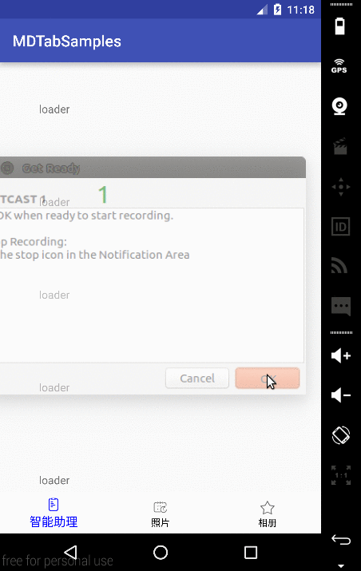
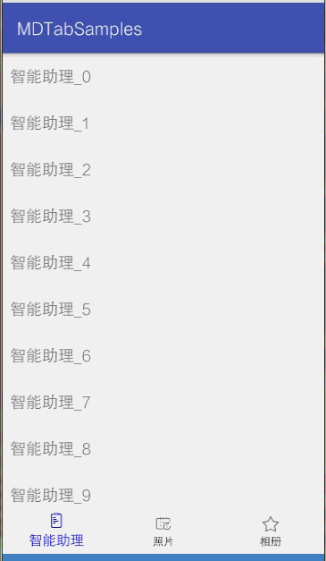

## MDTab

**一个仿google photos和google G+的Material Design风格的Tabbar**

### 更新 1.0.1
增加与ViewPager联动

### 如何使用

as引入：`compile 'org.loader:mdtab:1.0.1'`

在xml中使用

``` xml
<org.loader.mdtab.MDTab
    android:id="@+id/tab"
    android:layout_width="match_parent"
    android:layout_height="wrap_content"
    android:layout_gravity="bottom"
    android:textSize="12sp"
    app:checked_color="#FF0000FF"
    app:checked_percent="130%"
    app:normal_color="@android:color/black"
    app:ripple_color="#22448aca"
    android:background="@android:color/white"
    app:tab_padding="5dp" />
```
效果如下:


### 如何配合CoordinatorLayout使用

添加一条配置项目`app:layout_behavior="@string/tab_behavior"`就可以, 代码如下:

``` xml
<android.support.design.widget.CoordinatorLayout
    xmlns:android="http://schemas.android.com/apk/res/android"
    xmlns:app="http://schemas.android.com/apk/res-auto"
    android:layout_width="match_parent"
    android:layout_height="match_parent"
    android:orientation="horizontal">

    <android.support.v4.widget.NestedScrollView
        android:layout_width="match_parent"
        android:layout_height="match_parent">
        <LinearLayout
            android:layout_width="match_parent"
            android:layout_height="wrap_content"
            android:orientation="vertical">
            <TextView
                android:layout_width="wrap_content"
                android:layout_height="wrap_content"
                android:padding="50dp"
                android:text="loader" />
            <!-- 像这样的TextView还有不少个-->
        </LinearLayout>

    </android.support.v4.widget.NestedScrollView>

    <org.loader.mdtab.MDTab
        android:id="@+id/tab"
        android:layout_width="match_parent"
        android:layout_height="wrap_content"
        android:layout_gravity="bottom"
        android:textSize="12sp"
        app:checked_color="#FF0000FF"
        app:checked_percent="130%"
        app:layout_behavior="@string/tab_behavior"
        app:normal_color="@android:color/black"
        app:ripple_color="#22448aca"
        android:background="@android:color/white"
        app:tab_padding="5dp" />
</android.support.design.widget.CoordinatorLayout>
```

效果如下:



### 和ViewPager一块使用

调用方法
``` java
tab.setupWithViewPager(mViewPager);
```

实现效果：
